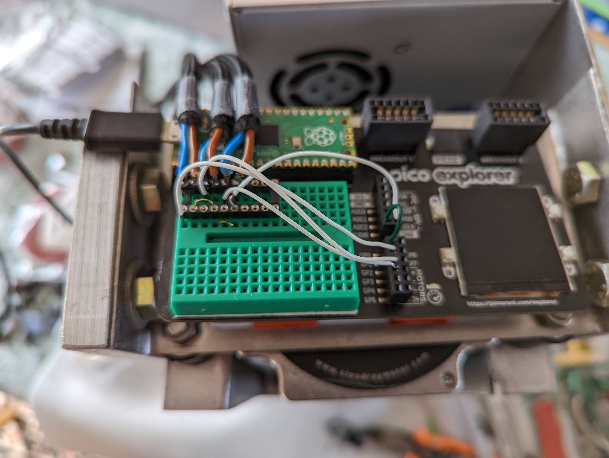

I developed projects before following the CPP projects of 42. The standard and the style may shock :)

# World's best coffee grinder
Hi there ! This is a preview of my coffee grinder project.

The aim is to drive my manual coffee grinder in order to get a precise amount of ground coffee.

Specifications :
- error ~= 0.01 g ! ( ~=0.5g for average barista grade coffee grinders)
- intuitive UI

This project covers following fields :
- Electronics
- Programming in C++
- Mechanical design

Final solution :

## Controller
Raspberry pi pico (this is a controller : no operating system)
- cheap
- amazing and very fast programmable I/O
- support C++

## Stepper motor
<p float="left">
  
  
  
</p>
A stepper motor is selected to drive the grinder :

### pros:
- high torque, low RPM (no need of gearbox)
- runs at precise
- long lifetime
- simpler mechanics
- sounds like futuristic CNC machine, not like a cheap blender

### cons:
- challenging to drive (but very fun) => requires us to program our own driver !
- expensive

### specifications :
- minimum torque (measured with a human scale) : 3 N.m
- rotation speed : 150 RPM

### choice
Nema 34 12N.m 6.0A DM860S (Cloudray)

### solution
Our library :
- Runs stepper pulse generator **in background** using PI/O (so we can do some stuff while the motor is running)
- **Guarantees continuous motor speed** to avoid damages (constant acceleration)
- Allows setting max acceleration and max speed

## Scale
<p float="left">
  
  
</p>
We choose a very light alumimium sensor, and a conventional HX 711 amplifier.

### pros:
- very accurate
- very cheap

### cons:
- challenging to drive (but very fun) => requires us to program our own driver !

### Solution
We use Pico's IO to read data output (and send gain choice) from HX711 according to supplier specifications : ```doc/hx711_english.pdf```
This was never done in C++, so we need to program our own library
<p float="left">
  
</p>

## Additional solutions required :
- elastic coupling between motor and grinder
- 80V to 5V power supply

## Graph


## Driver strategy
1. sensor sensitivity calibration UI
1. ask for mass target ```mt```
1. precise measurement of mass ```m0```
1. stripping (high acceleration short rotations)
1. brew 50% at high speed ```w0``` using live measurement (very inaccurate)
1. precise measurement of mass ```m1```
1. measurement of time ```t1```
1. brew 20% at low speed ```w1``` and high acceleration using live measurement (very inaccurate)
1. measurement of time ```t2```
1. precise measurement of mass ```m2```
1. guess mass flow rate ```fr = (m2 - m1) / (t2 - t1)```
1. remaining mass ```mr1 = mt - m2```
1. measurement of time ```t1```
1. brew 1/5th of remaining mass during ```t3 = 1/5 * mr1 / fr```
1. measurement of time ```t2```
1. guess mass flow rate ```fr = (m2 - m1) / (t2 - t1)```
1. repeat 5 previous steps 4 times

## Pictures
<p float="left">
  
  
</p>
Videos upcomming !

